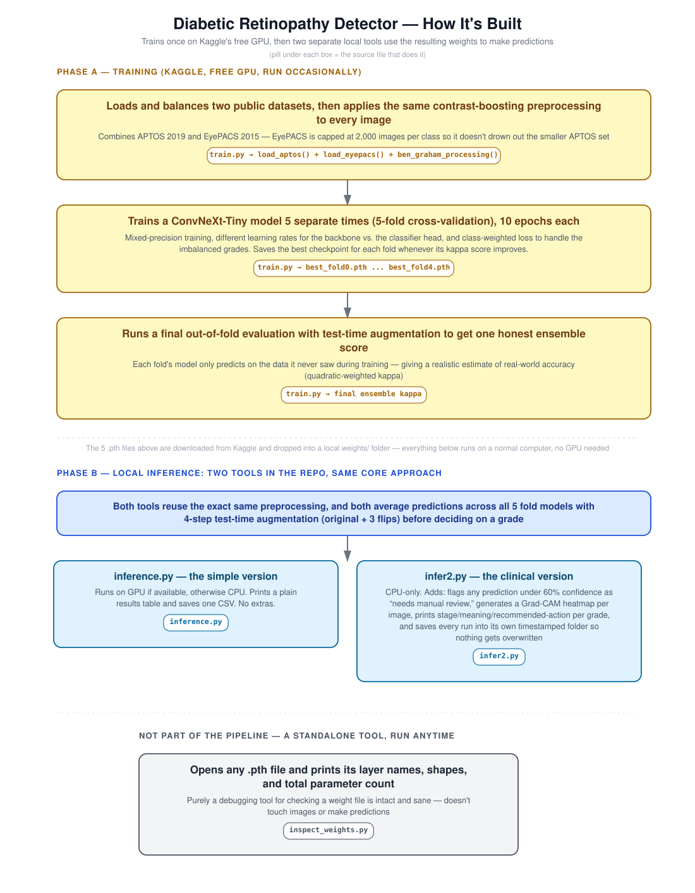

# Retinopathy-AI

Diabetic retinopathy grading using a ConvNeXt-Tiny ensemble trained on the APTOS dataset via Kaggle (free GPU).

## Output

<table width="100%">
  <tr>
    <td align="center" valign="top" width="50%">
      
       
      <strong>TTA Pipeline Confidence vs Baseline</strong>
    </td>
    <td align="center" valign="top" width="50%">
      
       
      <strong>DR Accuracy Breakdown on Unseen Data</strong>
    </td>
  </tr>
  <tr>
    <td align="center" valign="top" width="50%">
      
       
      <strong>5-Fold Best Val QWK Comparison</strong>
    </td>
    <td align="center" valign="top" width="50%">
      
       
      <strong>backbone.stem.0 Weight Distribution (Fold 0)</strong>
    </td>
  </tr>
</table>

## Architecture

# What it does:

Takes retinal fundus images as input and predicts the DR grade (0–4) using a 5-fold model ensemble with Test-Time Augmentation (TTA). Also generates Grad-CAM heatmaps to visualize which regions of the image influenced the prediction.

# Grades:

0 — No DR

1 — Mild DR

2 — Moderate DR

3 — Severe DR

4 — Proliferative DR

# Files:

infer2.py = Main inference script with Grad-CAM, uncertainty flagging, and detailed terminal output

inference.py = Simpler inference script — just grades + confidence

inspect_weights.py = Inspect loaded .pth weight files (layer count, param count, size)

# Usage

Full inference with Grad-CAM and uncertainty flagging:

python infer2.py

Simple inference (grade + confidence only):

python inference.py

Inspect weight files:

python inspect_weights.py

# Key features:

5-fold ensemble — averages predictions across multiple model weights for more reliable output

4-step TTA — runs each image through horizontal flip, vertical flip, and both, then averages

Uncertainty flagging — marks predictions below 60% confidence for manual review

Grad-CAM — saves heatmap overlays showing which retinal regions drove the prediction

Ben Graham preprocessing — standard fundus image enhancement before inference

# Notes:

Weights were trained on Kaggle using free GPU (T4)

Model: convnext_tiny.fb_in22k_ft_in1k  via the timm library

CPU inference supported; GPU used automatically if available

Each run saves to a timestamped folder inside results/ — no overwriting
