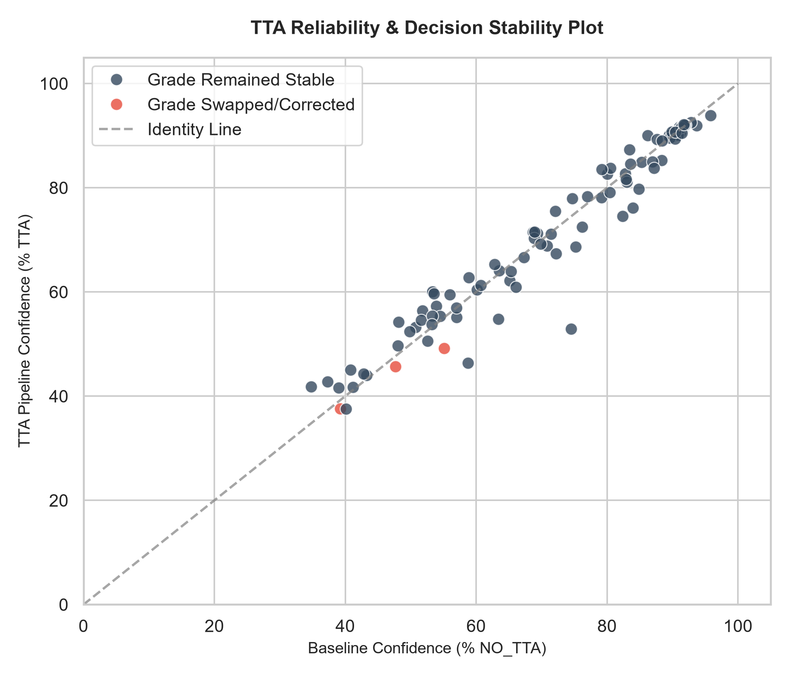
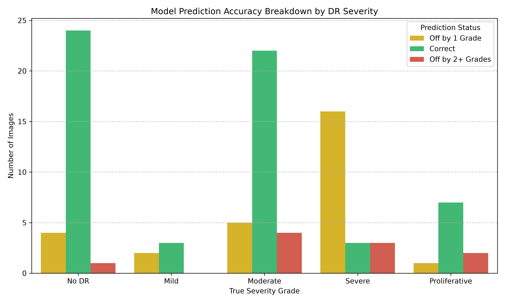
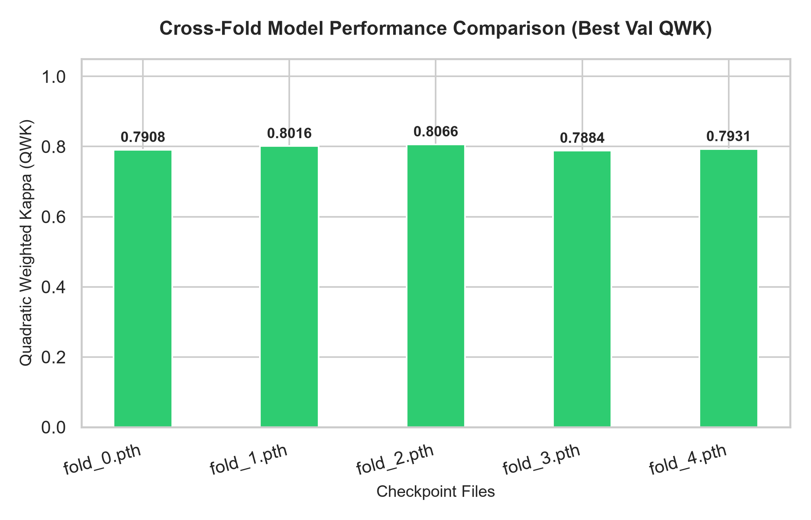
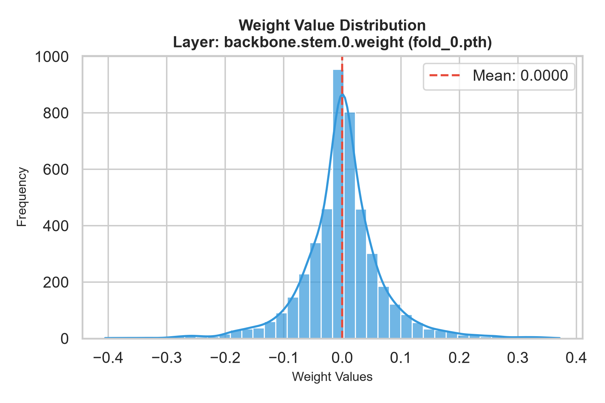

# Diabetic Retinopathy Classification with Fine-tuned ConvNeXt

Automated five-grade diabetic retinopathy (DR) classification from retinal fundus photographs. ConvNeXt-Tiny was fine-tuned on 11,243 EyePACS and APTOS images, validated with 5-fold cross-validation, and then tested on 97 unseen IDRiD images from a different source dataset. Inference runs a five-model ensemble with test-time augmentation and flags low-confidence predictions for human review.

> **Research use only.** This is not intended for diagnosis or treatment decisions.


## Output

<table width="100%">
  <tr>
    <td align="center" valign="top" width="50%">
      
      <br />
      <strong>TTA Pipeline Confidence vs Baseline</strong>
    </td>
    <td align="center" valign="top" width="50%">
      
      <br />
      <strong>DR Accuracy Breakdown on Unseen Data</strong>
    </td>
  </tr>
  <tr>
    <td align="center" valign="top" width="50%">
      
      <br />
      <strong>5-Fold Best Val QWK Comparison</strong>
    </td>
    <td align="center" valign="top" width="50%">
      
      <br />
      <strong>backbone.stem.0 Weight Distribution (Fold 0)</strong>
    </td>
  </tr>
</table>


## Results 

| Evaluation | Metric | Result |
|---|---|---:|
| 5-fold cross-validation (mean) | QWK | 0.796 |
| Out-of-fold, 11,243 images | QWK | 0.794 |
| Out-of-fold, 11,243 images | Within one grade | 93.3% |
| **Unseen IDRiD, 97 images** | **QWK** | **0.775** |
| **Unseen IDRiD, 97 images** | **Within one grade** | **89.7%** |
| **Unseen IDRiD, 97 images** | **Referable DR (grade 2+) sensitivity** | **82.5%** |
| **Unseen IDRiD, 97 images** | **Referable DR (grade 2+) specificity** | **97.1%** |

QWK (quadratic weighted kappa) is the standard metric for DR grading. It penalizes predictions more the further they land from the true grade, where 1.0 is perfect agreement. The unseen-data QWK is close to the cross-validation QWK, which indicates the model generalizes across sources rather than memorizing its training set. The main weakness is Severe (grade 3) under-grading, covered under Limitations.

## What was built

- A fine-tuning pipeline with 5-fold cross-validation and best-QWK checkpoint selection
- An out-of-fold evaluation over every training image, each scored by a model that never trained on it
- An external evaluation on an unseen dataset, with per-image results and error analysis
- An ensemble inference script with test-time augmentation, an uncertainty flag and optional Grad-CAM output

## Grades

| Grade | Label | Description |
|:---:|---|---|
| 0 | No DR | No visible retinopathy |
| 1 | Mild | Microaneurysms only |
| 2 | Moderate | More than microaneurysms, less than severe |
| 3 | Severe | Extensive hemorrhages, venous beading |
| 4 | Proliferative | Neovascularization, advanced disease |

## Approach

**Data.** 11,243 images: EyePACS 7,581 and APTOS 3,662. Grade counts are 3,805 / 2,370 / 2,999 / 1,066 / 1,003 for grades 0 to 4. EyePACS was capped at 2,000 images per grade to limit imbalance. Folds are stratified by source and grade.

**Preprocessing.** Applied identically at training and inference: crop the black border, resize to 448 × 448, apply Ben Graham contrast enhancement (subtract a Gaussian-blurred copy) to emphasize lesions and vessels, then apply a circular mask.

**Model.** `convnext_tiny.fb_in22k_ft_in1k` (about 27.8M parameters) with a 5-class classification head and an auxiliary 4-output ordinal head. The ordinal head is used only as a training signal. Inference uses the classification head.

**Training.**

| | |
|---|---|
| Loss | 0.70 × cross-entropy (class-weighted, label smoothing 0.05) + 0.30 × ordinal loss |
| Learning rates | Head 1e-4, backbone 2e-5, 1 warm-up epoch |
| Regularization | Dropout 0.20, weight decay 1e-4, gradient clipping 1.0 |
| Weight averaging | EMA, decay 0.999 |
| Augmentation | Horizontal flip, small affine (rotation ±15°, scale 0.95 to 1.05, shear ±3°), brightness/contrast, light blur |
| Schedule | 10 epochs per fold, batch size 16, early-stopping monitor (patience 5) |
| Hardware | NVIDIA Tesla T4, about 7.25 hours in total |

**Inference.** Each of the five fold models predicts on the original image and three flipped versions (horizontal, vertical, both), giving 20 forward passes per image. The softmax outputs are averaged to produce the grade and confidence. Predictions with confidence below 60% are flagged as uncertain.

## Validation

### Cross-validation

| Fold | Best QWK | Accuracy | Macro-F1 |
|:---:|:---:|:---:|:---:|
| 1 | 0.7908 | 0.6065 | 0.6096 |
| 2 | 0.8016 | 0.6327 | 0.6216 |
| 3 | 0.8066 | 0.6234 | 0.6211 |
| 4 | 0.7884 | 0.5992 | 0.5935 |
| 5 | 0.7931 | 0.6206 | 0.6156 |
| **Mean** | **0.7961** | **0.6165** | **0.6123** |

### Out-of-fold (all 11,243 images)

| Metric | Score |
|---|---:|
| Accuracy | 0.6166 |
| Macro-F1 | 0.6142 |
| QWK | 0.7937 |

Confusion matrix (rows = true grade, columns = predicted grade):

```text
        Pred 0  Pred 1  Pred 2  Pred 3  Pred 4
True 0    2359    1219     196       3      28
True 1     315    1590     425      11      29
True 2     118     655    1681     413     132
True 3       9      55     253     630     119
True 4       3      26     140     162     672
```

### External validation (IDRiD, 97 unseen images)

These images were not used for training or model selection. Evaluation used the full five-model ensemble with test-time augmentation.

| Metric | Score |
|---|---:|
| Accuracy | 0.6082 |
| Macro-F1 | 0.5337 |
| QWK | 0.7751 |
| Within one grade | 89.7% (87 of 97) |
| Off by two or more grades | 10 of 97 |

Confusion matrix (rows = true grade, columns = predicted grade):

```text
        Pred 0  Pred 1  Pred 2  Pred 3  Pred 4
True 0      24       4       1       0       0
True 1       2       3       0       0       0
True 2       3       5      22       0       1
True 3       2       1      13       3       3
True 4       0       0       2       1       7
```

Per-grade results:

| Grade | Images | Precision | Recall | F1 |
|:---:|:---:|:---:|:---:|:---:|
| 0 No DR | 29 | 0.77 | 0.83 | 0.80 |
| 1 Mild | 5 | 0.23 | 0.60 | 0.33 |
| 2 Moderate | 31 | 0.58 | 0.71 | 0.64 |
| 3 Severe | 22 | 0.75 | 0.14 | 0.23 |
| 4 Proliferative | 10 | 0.64 | 0.70 | 0.67 |

**Referable DR (grade 2 or higher).** Collapsing predictions into "needs referral" versus "does not" gives 82.5% sensitivity (52 of 63 cases caught), 97.1% specificity (33 of 34 correctly cleared) and 87.6% accuracy. This is a regrouping of the same predictions, not a separately trained model.

**Uncertainty flag.** Predictions at or above 60% confidence (68 images) were 67.6% accurate, while those below 60% (29 images) were 44.8% accurate. Low confidence therefore does signal a less reliable result.

The charts above show the per-grade accuracy breakdown on this dataset and the effect of test-time augmentation on prediction confidence.

## Limitations

- **Severe (grade 3) is under-graded.** Only 3 of 22 Severe images were correct, and 13 were predicted as Moderate. Across the unseen set the model under-graded 29 images and over-graded 9. Severe is also 23% of the unseen set but only 9.5% of the training data, which makes this weakness more visible.
- **Confident misses exist.** Four images with true grade 2 or 3 were predicted as No DR at 85 to 91% confidence. The uncertainty flag cannot catch these cases.
- **The unseen set is small.** With 97 images, Mild (5) and Proliferative (10) per-grade figures are indicative only, and every headline number carries wide uncertainty.
- **No DR versus Mild is often confused.** In the out-of-fold set, 32% of No DR images were predicted as Mild. This boundary is subtle, and label consistency between these grades is a known issue in public DR datasets.
- **Confidence is not calibrated.** The score is an ensemble-averaged softmax value and does not equal the probability of being correct.
- **Training prevalence differs from screening prevalence.** Capping and class-weighting mean the model saw far more disease than a real screening population contains.
- **Cross-validation is slightly optimistic.** Splits are by image rather than by patient, and checkpoints are selected on the same fold used to report its score. The IDRiD result is not affected by either.
- **No input quality check.** The model assigns a grade to any image it receives, including non-fundus or poor-quality photos.


## Repository

| File | Purpose |
|---|---|
| `training_code.py` | Fine-tuning with 5-fold cross-validation |
| `evaluate_oof.py` | Out-of-fold evaluation across all five folds |
| `inference_script.py` | Ensemble inference with test-time augmentation and uncertainty flag |
| `evaluate.py` | Scoring of predictions on the unseen IDRiD images |
| `inspect_weights.py` | Checkpoint inspection and summary charts |
| `*.md` result files | Training and out-of-fold result summaries |

`training_code.py` and `evaluate_oof.py` were run on Kaggle, so their data paths point to Kaggle directories.

Trained weights are not included in this repository. `inference_script.py` expects the five fold checkpoints (`fold_0.pth` to `fold_4.pth`) in a `weights/` folder.

## Data credits

EyePACS, APTOS 2019 Blindness Detection, and IDRiD (Indian Diabetic Retinopathy Image Dataset).